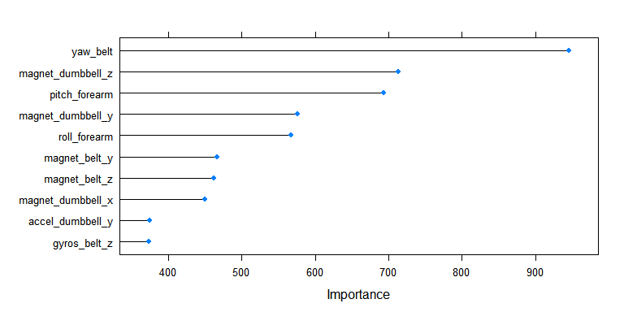
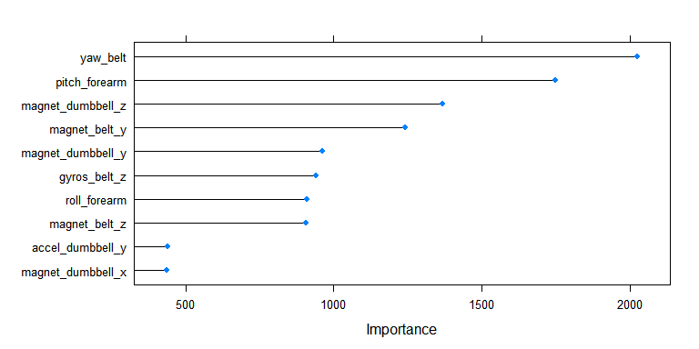
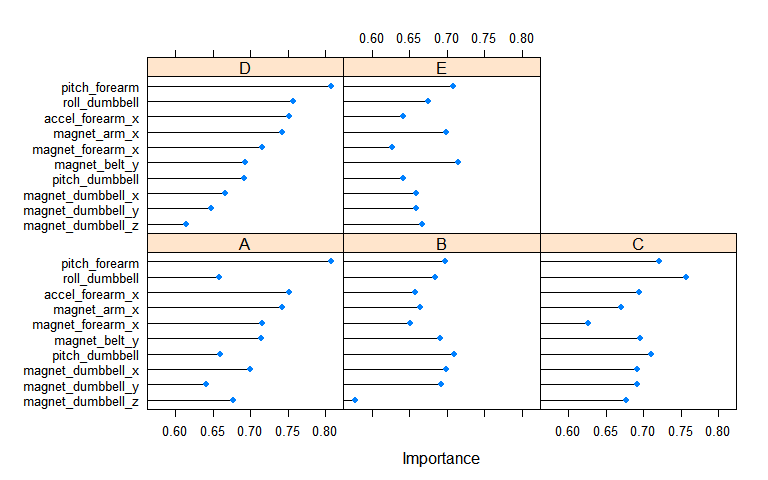

# Exercise Quality Prediction
Abimbola M  
February 26, 2015  

### Executive Summary

Using data from 4 accelerometers on 6 participants, a model with 99.7% accuracy was used to predict the quality of barbell lifts in 20 test subjects.    

  - Some of the data were discarded due to missing information: variables with no data, Variables with identifiers and timestamps, and variables with greater than 80% correlation. The remaining data with 39 predictors were used for the rest of the analysis.
  - The labelled training set was further divided into a training and testing sets. 3 models were built and compared using their performance on the labelled testing set (a subset of the original training set). The random forest model outperforms boosting trees and support vector machine and very comparable with an ensemble model of the three previously mentioned models.
  - Classification of unlabelled test set was done with the random forest model. The quality prediction for each subject is the same for all the models and only 7 out the 20 subjects perfomed the lift exactly to specification.


### Background

Devices such as Jawbone Up, Nike FuelBand, and Fitbit collect large amount of data about personal activity. This information is popularly used to quantitfy particular activities but rarely the quality of such activities. This project uses data from accelerometers on the belt,forearm,arm, and the dumbell of 6 participants who were asked to perform barbell lifts correctly and incorrectly in 5 different ways.  

The data and more information is available from the website here: http://groupware.les.inf.puc-rio.br/har (see the section the Weight Lifting Exercise Dataset).
The datasets can be downloaded here: [training](https://d396qusza40orc.cloudfront.net/predmachlearn/pml-training.csv) and [test](https://d396qusza40orc.cloudfront.net/predmachlearn/pml-testing.csv).


### Data Cleaning

Load caret and doParallel libraries.

```r
library(caret)
library(doParallel)
```

Load datasets 

```r
train <- read.csv("pml-training.csv",sep=",", header=TRUE, stringsAsFactors=TRUE, 
                  na.string=c("NA","#DIV/0!"))

test <- read.csv("pml-testing.csv",sep=",", header=TRUE, stringsAsFactors=TRUE,
                 na.string=c("NA","#DIV/0!"))
```

Check for missing data


```r
y <- apply(train,2,function(x){sum(is.na(x))})
table(y)
```

```
y
    0 19216 19217 19218 19220 19221 19225 19226 19227 19248 19293 19294 
   60    67     1     1     1     4     1     4     2     2     1     1 
19296 19299 19300 19301 19622 
    2     1     4     2     6 
```

The training dataset has 19622 observations and 160 variables and only 60 variables have no missing data for all the observations; remove the variables with missing data. 


```r
## Remove columns with missing variables
train1 <- train[colSums(is.na(train)) == 0]
```

Examine the data structure


```r
str(train1); names(train1)
## Remove columns with identifiers, timestamps, and redundant dataset.
train1 <- train1[,-c(1:7)] 
rm(train)
```

There are 53 variables left. For compuational efficiency, remove features that are higly correlated


```r
## Identify correlated predictors
descrCor <- cor(train1[,-53]) #exclude activity labels
highCorr <- sum(abs(descrCor[upper.tri(descrCor)]) > .80)
highCorr
```

```
[1] 19
```

Remove these 19 features that are higly correlated


```r
highlyCorDescr <- findCorrelation(descrCor, cutoff = .80)
train1 <- train1[,-highlyCorDescr]; dim(train1)
```

```
[1] 19622    40
```

In total 40 variables, including the dependent variable, are left for model training. The higly correlated variables could have been kept since they don't affect tree modeling significantly, but I removed them for computational efficiency.

### Modeling

Split the training set into two. I'm taking advantage of this fairly large set to check the performance of my models before the final test set prediction.


```r
set.seed(998)
inTraining <- createDataPartition(train1$classe, p = .75, list = FALSE)
training <- train1[inTraining,]
testing  <- train1[-inTraining,]
```

Generate seeds for resampling.


```r
#create a list of seed
set.seed(123)
seeds <- vector(mode="list",length=11)
for(i in 1:10) seeds[[i]] <- sample.int(1000,8)
seeds[[11]] <- sample.int(1000,1)
```

Register a backend for parallel computation


```r
cl <- makeCluster(detectCores())
registerDoParallel(cl)
```

My control parameters for training includes a YeoJohnson transformation (some variables have zeros and negative values) and removal of variables with near-zero-variance. The latter because the variables with lots of zeros and few unique values may have undue influence on the modeling. 


```r
## Control parameters
ctrl = trainControl(method="cv",seeds=seeds,allowParallel=TRUE, 
                    preProc=c("center","scale", "YeoJohnson", "nzv"))
```


####*Random Forest Model*

```r
rfGrid <- expand.grid(mtry=c(1,2,4,6))
Model1 <- train(classe ~ ., method = "rf", tuneGrid=rfGrid, trControl=ctrl, data=training)
Model1$finalModel
```

```

Call:
 randomForest(x = x, y = y, mtry = param$mtry) 
               Type of random forest: classification
                     Number of trees: 500
No. of variables tried at each split: 6

        OOB estimate of  error rate: 0.61%
Confusion matrix:
     A    B    C    D    E class.error
A 4180    4    0    1    0 0.001194743
B   12 2829    6    0    1 0.006671348
C    0   19 2545    3    0 0.008570316
D    1    0   32 2376    3 0.014925373
E    0    0    1    7 2698 0.002956393
```

The final model has 500 trees and 6 variables tried at each split for prediction with an OOB estimate of 0.61%. This is pretty impressive! It leaves little room for improvement, but I will play around with other models.





####*Generalized boosted model*

```r
gbGrid <- expand.grid(interaction.depth = c(1,2,4), n.trees = c(100,150,200), shrinkage = 0.1, n.minobsinnode = 20)
Model2 <- train(classe ~ ., method="gbm", data=training, trControl=ctrl, tuneGrid=gbGrid, verbose=FALSE)
Model2
```

```
Stochastic Gradient Boosting 

14718 samples
   39 predictor
    5 classes: 'A', 'B', 'C', 'D', 'E' 

No pre-processing
Resampling: Cross-Validated (10 fold) 
Summary of sample sizes: 13246, 13245, 13246, 13247, 13247, 13247, ... 
Resampling results across tuning parameters:

  interaction.depth  n.trees  Accuracy   Kappa      Accuracy SD
  1                  100      0.7893062  0.7333506  0.011186151
  1                  150      0.8287154  0.7832129  0.010561482
  1                  200      0.8520207  0.8126579  0.011809708
  2                  100      0.8901378  0.8609382  0.012669211
  2                  150      0.9179249  0.8961371  0.007730081
  2                  200      0.9346385  0.9172918  0.005702638
  4                  100      0.9492459  0.9357780  0.003693731
  4                  150      0.9654168  0.9562446  0.003570096
  4                  200      0.9760160  0.9696593  0.002882499
  Kappa SD   
  0.014176297
  0.013419605
  0.015009138
  0.016048196
  0.009785022
  0.007219941
  0.004693748
  0.004525562
  0.003649636

Tuning parameter 'shrinkage' was held constant at a value of 0.1

Tuning parameter 'n.minobsinnode' was held constant at a value of 20
Accuracy was used to select the optimal model using  the largest value.
The final values used for the model were n.trees = 200,
 interaction.depth = 4, shrinkage = 0.1 and n.minobsinnode = 20. 
```

The final model has 200 trees and an interaction depth of 4 with 97.8% accuracy, lower than the random forest model by 2%




####*Support Vector Machine*

```r
Model3 <- train(classe ~ ., data = training, method = "svmRadial", tuneLength=4, trControl=ctrl)
Model3
```

```
Support Vector Machines with Radial Basis Function Kernel 

14718 samples
   39 predictor
    5 classes: 'A', 'B', 'C', 'D', 'E' 

No pre-processing
Resampling: Cross-Validated (10 fold) 
Summary of sample sizes: 13246, 13247, 13247, 13247, 13247, 13246, ... 
Resampling results across tuning parameters:

  C     Accuracy   Kappa      Accuracy SD  Kappa SD   
  0.25  0.8668291  0.8310376  0.004866730  0.006145267
  0.50  0.9001227  0.8733053  0.006063174  0.007705653
  1.00  0.9257396  0.9058396  0.007762574  0.009869862
  2.00  0.9485000  0.9347553  0.006327748  0.008029365

Tuning parameter 'sigma' was held constant at a value of 0.01650208
Accuracy was used to select the optimal model using  the largest value.
The final values used for the model were sigma = 0.01650208 and C = 2. 
```

The final model has a cost function of 2 and accuracy of 94.9%. Increasing the cost function may actually increase its accuracy but I will keep it this way to avoid overfitting.



I wish I have a better way to reduce this plot to one box since the variables importance are the same across all classes of activity.

The top 10 variables on the importance scale are the same for models 1 and 2. Only 5 of the top 10 in the support vector model (model3) are shared with the other models. 3 of these 5 variables are the same: magnetdumbell in three dimensional plane(x,y,z). The top 3 important variables are the same for the the first 2 models and 1 of the 3 variables, pitchforearm, is the most important variable in Model3 prediction 

####*Discriminant Model*
For curiosity sake, let's see how discriminant models perform. I already have a model with an OOB error rate of 0.61% so I am not expecting much. 


```
Linear Discriminant Analysis 

14718 samples
   39 predictor
    5 classes: 'A', 'B', 'C', 'D', 'E' 

No pre-processing
Resampling: Bootstrapped (25 reps) 
Summary of sample sizes: 14718, 14718, 14718, 14718, 14718, 14718, ... 
Resampling results

  Accuracy   Kappa     Accuracy SD  Kappa SD   
  0.6476778  0.554547  0.005758262  0.006968372

 
```


```
Quadratic Discriminant Analysis 

14718 samples
   39 predictor
    5 classes: 'A', 'B', 'C', 'D', 'E' 

No pre-processing
Resampling: Bootstrapped (25 reps) 
Summary of sample sizes: 14718, 14718, 14718, 14718, 14718, 14718, ... 
Resampling results

  Accuracy   Kappa      Accuracy SD  Kappa SD   
  0.8653119  0.8296268  0.004361273  0.005597815

 
```


Unsurprisingly, the quadratic discriminant model performed better than the linear and both performed poorly compared to the three models above. They will not be considered further.

####*Perfomance testing* 

```r
Pred1 <- predict(Model1, testing)
confusionMatrix(Pred1, testing$classe)$overall
```

```
      Accuracy          Kappa  AccuracyLower  AccuracyUpper   AccuracyNull 
     0.9944943      0.9930352      0.9919995      0.9963687      0.2844617 
AccuracyPValue  McnemarPValue 
     0.0000000            NaN 
```

```r
Pred2 <- predict(Model2, testing)
confusionMatrix(Pred2, testing$classe)$overall
```

```
      Accuracy          Kappa  AccuracyLower  AccuracyUpper   AccuracyNull 
     0.9781811      0.9723990      0.9736942      0.9820853      0.2844617 
AccuracyPValue  McnemarPValue 
     0.0000000            NaN 
```

```r
Pred3 <- predict(Model3, testing)
confusionMatrix(Pred3, testing$classe)$overall
```

```
      Accuracy          Kappa  AccuracyLower  AccuracyUpper   AccuracyNull 
     0.9477977      0.9338612      0.9411986      0.9538570      0.2844617 
AccuracyPValue  McnemarPValue 
     0.0000000            NaN 
```

The accuracy of the three models above on the testing set is the same as its performance on the training set. Time to answer the main question: how well are the 20 test subjects performing the barbell lifts?

####*Prediction of the unlabelled 20 test subjects*
The model with the best OOB estimate, random forest model, will be used to make the classification. 

```r
##Test subjects classification
table(predict(Model1, test))
```

```

A B C D E 
7 8 1 1 3 
```

Since the accuracy of the 3 models are quite high, I wonder if they make the same prediction for each subject.


```r
identical(predict(Model1, test), predict(Model2, test), predict(Model3, test))
```

```
[1] TRUE
```

### Conclusion
Only 7 of the 20 test subjects performed the exercise exactly to specification.
